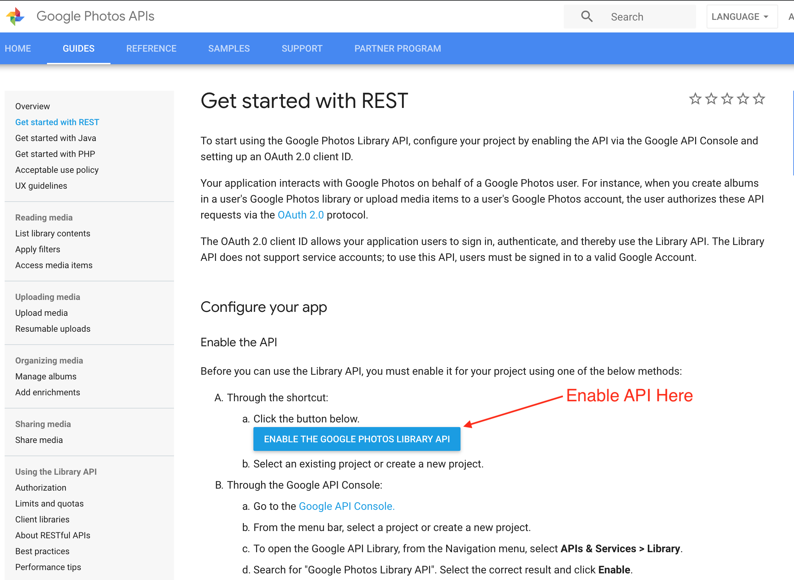
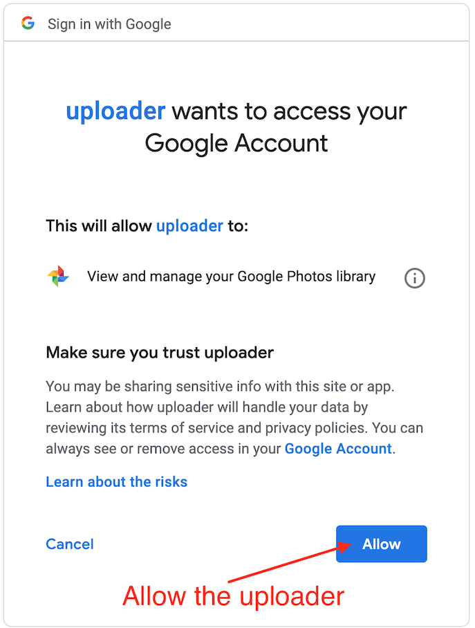

# google-photos-uploader

Python based uploader for uploading files to [Google Photos](https://photos.google.com/) from the commandline.
This script has been tested uploading a directory with over 5000 images in it.

## Setup

1. Install requirements: `pip install -r requirements.txt`
2. Signup for an Google Photos API here: https://developers.google.com/photos/library/guides/get-started

3. Download the `credentials.json` file and place it in this directory

## Run

1. Run `./google-photos-uploader.py -a <album_name> -d <directory_to_upload_files_from>`
2. You will be prompted with the following:
```bash
Please visit this URL to authorize this application: https://accounts.google.com/o/oauth2/auth?response_type=code&client_id=<your_client_id>&redirect_uri=urn%3Aietf%3Awg%3Aoauth%3A2.0%3Aoob&scope=https%3A%2F%2Fwww.googleapis.com%2Fauth%2Fphotoslibrary&state=<custom_state>&prompt=consent&access_type=offline
Enter the authorization code:
```
3. Visit the provided URL and agree to terms:

4. Copy the authorization code from the following page:

5. Enter in your authorization code in the terminal and hit enter.

Note: If the album doesn't exist this script will create it for you.

## Example Run

```bash
$ ./uploader.py -a "My Photos" -d photos/
Please visit this URL to authorize this application: https://accounts.google.com/o/oauth2/auth?response_type=code&client_id=<your_client_id>&redirect_uri=urn%3Aietf%3Awg%3Aoauth%3A2.0%3Aoob&scope=https%3A%2F%2Fwww.googleapis.com%2Fauth%2Fphotoslibrary&state=<custom_state>&prompt=consent&access_type=offline
Enter the authorization code: <your_authorization_code>
Found 5442 files in photos/
100%|████████████████████████████████████████████████████████████████████████████████████████████████████████████| 5442/5442 [3:11:22<00:00,  1.70s/it]
Successfully uploaded 5442 files, failed to upload 0 files
```

## TODOs

- Provide caching of credentials so you don't need to re-authenticate on every run
- Add Travis CI
    - Add linting
    - Add tests
- Add coverage reports (https://coveralls.io)

## License

GNU GENERAL PUBLIC LICENSE v3 - See the [LICENSE](LICENSE) file for more information
